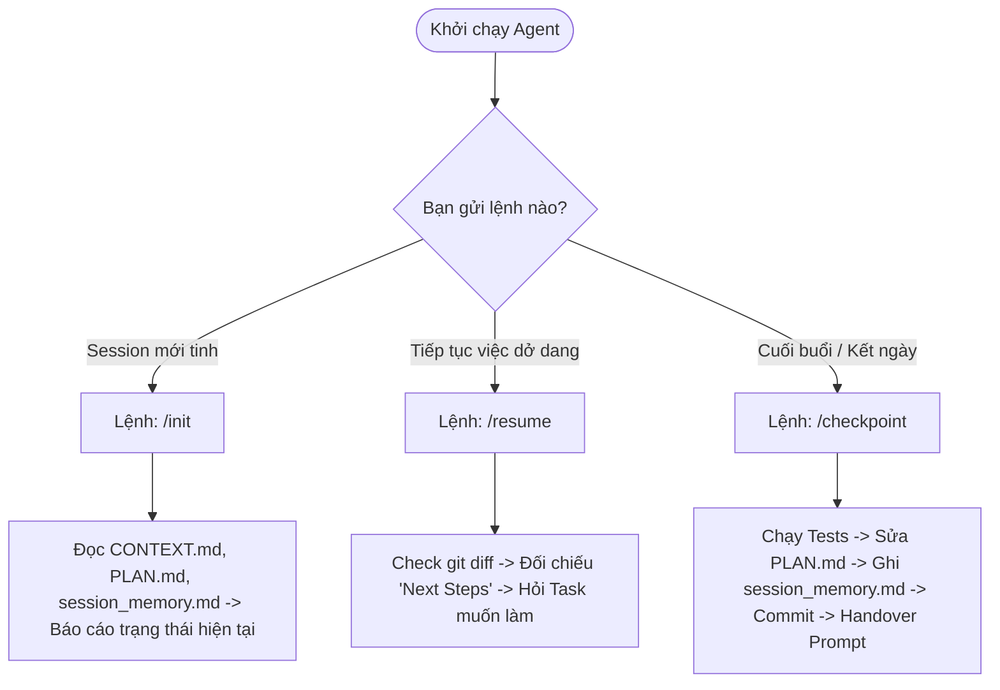

# 🗺️ Zeflyo Agent Orchestrator & Session Lifecycle Guide
> *Last updated: 2026-06-15 | Path: `.agent/rules/ORCHESTRATOR.md`*

Tài liệu này là **Động Cơ Điều Phối Trung Tâm (Orchestrator)** cho AI Agent (Antigravity). File này giúp tự động hóa và đồng bộ hóa toàn bộ vòng đời của các phiên làm việc (Session), tránh lặp đi lặp lại chỉ dẫn và tối ưu hóa context token.

---

## 🚦 Quy Trình Tự Động Nhận Diện Trạng Thái (Lifecycle State Machine)

Khi bạn tương tác với Agent, hãy sử dụng các lệnh trigger tương ứng với trạng thái phiên làm việc. Agent sẽ tự động thực hiện các bước chất lượng (Quality Gates) tương ứng:

---

## 📋 Đặc Tả Hành Động Chi Tiết Cho Agent

### 1. Khi chạy `/init` (Khởi tạo phiên mới)
*   **Hành động của Agent**:
    1.  Đọc file [CONTEXT.md](file:///r:/_Projects/Eurus_Workspace/Zeflyo/.agent/rules/CONTEXT.md) để hiểu cấu trúc thư mục và Tech Stack của Zeflyo.
    2.  Đọc file [PLAN.md](file:///r:/_Projects/Eurus_Workspace/Zeflyo/.agent/rules/PLAN.md) để nắm lộ trình.
    3.  Đọc file [session_memory.md](file:///r:/_Projects/Eurus_Workspace/Zeflyo/.agent/workflows/session_memory.md) để biết trạng thái checkpoint gần nhất.
    4.  **Phản hồi lại**: Tóm tắt ngắn gọn 3 câu (Trạng thái hạ tầng, Tính năng đã xong, và danh sách 3 bước tiếp theo cần làm).

### 2. Khi chạy `/resume` (Tiếp tục việc từ hôm qua)
*   **Hành động của Agent**:
    1.  Chạy lệnh kiểm tra `git status` và `git diff` để xem có code nào đang viết dở ở local không.
    2.  Đọc phần `Next Steps` trong [session_memory.md](file:///r:/_Projects/Eurus_Workspace/Zeflyo/.agent/workflows/session_memory.md).
    3.  **Phản hồi lại**: *"Chào bạn, tôi thấy hôm qua chúng ta đang làm dở [Task X]. Có các file thay đổi là [File Y]. Bạn có muốn tiếp tục làm [Task X] hay chuyển sang Task khác trong danh sách Next Steps?"*

### 3. Khi chạy `/checkpoint` (Cuối buổi / Kết thúc ngày)
*   **Hành động của Agent**:
    1.  **Chạy verify**: Chạy lệnh build kiểm thử (`php artisan test` hoặc lint) để đảm bảo không có code lỗi trước khi lưu.
    2.  **Cập nhật PLAN.md**: Đánh dấu `[x]` cho các task đã hoàn thành và `[/]` cho task đang làm dở.
    3.  **Ghi session_memory.md**: Ghi đè file [session_memory.md](file:///r:/_Projects/Eurus_Workspace/Zeflyo/.agent/workflows/session_memory.md) tóm tắt các task đã xong, các quyết định thiết kế quan trọng và cập nhật 3 bước kỹ thuật kế tiếp (Next Steps).
    4.  **Commit Git**: Gợi ý cho bạn lệnh git commit để lưu trữ context.
    5.  **Xuất Handover Prompt**: In ra đoạn text Handover Prompt mẫu để bạn lưu lại cho buổi sau.

---

## 💬 Mẫu Lệnh Copy-Paste Dành Cho Bạn (Developer)

Bạn chỉ cần lưu file này lại và dùng đúng các câu lệnh sau để ra lệnh cho Agent:

### 🌟 Câu lệnh 1: Khi mở phiên chat mới tinh
> **`/init`** (hoặc copy câu dưới đây)
> *"Hãy chạy lệnh khởi tạo `/init` từ file [ORCHESTRATOR.md](file:///r:/_Projects/Eurus_Workspace/Zeflyo/.agent/rules/ORCHESTRATOR.md) để đọc cấu trúc context và báo cáo trạng thái hiện tại của dự án."*

### 🔄 Câu lệnh 2: Khi tiếp tục làm việc dở dang (ví dụ: sang ngày hôm sau)
> **`/resume`** (hoặc copy câu dưới đây)
> *"Hãy chạy lệnh `/resume` từ file [ORCHESTRATOR.md](file:///r:/_Projects/Eurus_Workspace/Zeflyo/.agent/rules/ORCHESTRATOR.md) để quét git diff hiện tại và đối chiếu với Next Steps trong session_memory."*

### 💾 Câu lệnh 3: Khi kết thúc ngày làm việc / cuối buổi
> **`/checkpoint`** (hoặc copy câu dưới đây)
> *"Hãy chạy lệnh `/checkpoint` từ file [ORCHESTRATOR.md](file:///r:/_Projects/Eurus_Workspace/Zeflyo/.agent/rules/ORCHESTRATOR.md) để chạy verify test, cập nhật PLAN.md, ghi session_memory.md và xuất Handover Prompt."*
