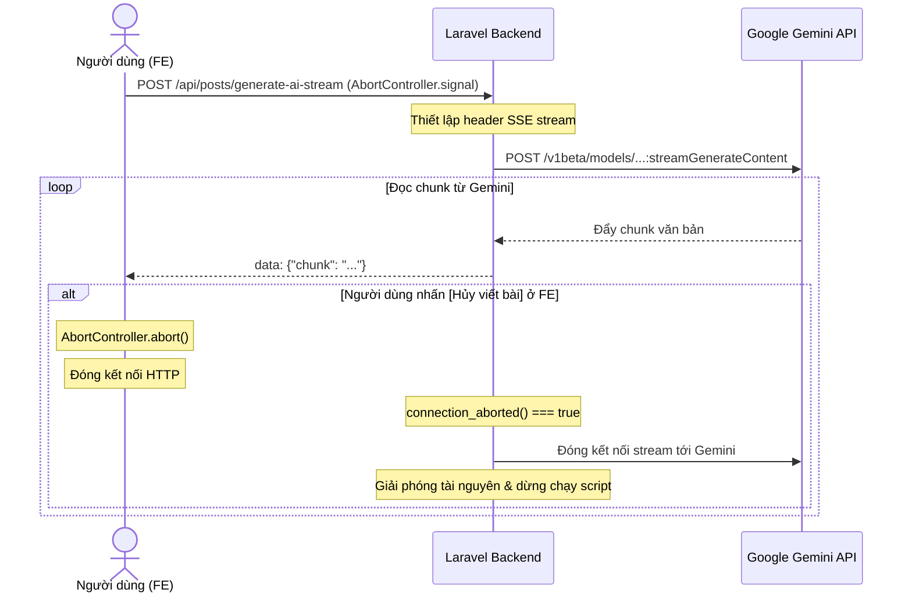

# Phase 7: Tối ưu hóa Trải nghiệm AI, Tiết kiệm Token (SSE Streaming) & Tích hợp Công thức Marketing (AIDA/PAS/BAB)

## 🎯 Mục tiêu
1. **Đơn giản hóa UI/UX cho người Non-tech**: Loại bỏ sự mơ hồ khi viết prompt, ẩn các tùy chọn phức tạp, bổ sung các mẫu gợi ý chủ đề (Prompt Chips) và các công thức Marketing ăn khách.
2. **Tiết kiệm chi phí API Token (SSE Streaming + Abort)**: Triển khai Server-Sent Events (SSE) để truyền phát nội dung từ Gemini theo thời gian thực (typing effect). Cho phép người dùng dừng tạo bài giữa chừng (Cancel) và tự động ngắt kết nối phía backend để ngăn Gemini tiếp tục tính phí token.
3. **Nâng tầm chất lượng nội dung với Marketing Frameworks**: Tích hợp 3 công thức viết bài kinh điển **AIDA**, **PAS**, **BAB** theo nguyên tắc **Value-First** (trao giá trị hữu ích 70%, giới thiệu sản phẩm/bán hàng 30%) để thu hút và giữ chân người đọc lâu hơn.

---

## 📋 Phạm vi Phase 7

| Hạng mục | Tính năng | Trạng thái |
|---|---|---|
| **Backend** | Nâng cấp `GeminiService` hỗ trợ API stream (`streamGenerateContent`) | ⬜ Chưa làm |
| **Backend** | API Route `/api/posts/generate-ai-stream` (Server-Sent Events) | ⬜ Chưa làm |
| **Backend** | Tự động phát hiện ngắt kết nối client (`connection_aborted()`) để dừng gọi Gemini | ⬜ Chưa làm |
| **Backend** | Tích hợp hệ thống Prompts chuẩn hóa cho 3 công thức: AIDA, PAS, BAB | ⬜ Chưa làm |
| **Frontend** | Giao diện tinh gọn: Ẩn Advanced Settings, hiển thị 3 Card Công thức | ⬜ Chưa làm |
| **Frontend** | Gợi ý chủ đề nhanh (Prompt Chips/Presets) theo ngành hàng | ⬜ Chưa làm |
| **Frontend** | Kết nối SSE, hiển thị hiệu ứng chữ chạy (Typing Effect) mượt mà | ⬜ Chưa làm |
| **Frontend** | Nút "Hủy viết bài" (Cancel/Abort) tích hợp `AbortController` | ⬜ Chưa làm |

---

## 🔌 API Endpoints

### 📡 Luồng Truyền phát Bài đăng AI (Server-Sent Events)
* **Method**: `POST` (hoặc `GET` với Query params nếu cần giữ chuẩn SSE nguyên bản, khuyến nghị `POST` để truyền payload cấu hình lớn)
* **Endpoint**: `/api/posts/generate-ai-stream`
* **Headers yêu cầu**:
  * `Accept: text/event-stream`
  * `Cache-Control: no-cache`
  * `Connection: keep-alive`
* **Request Body**:
  ```json
  {
    "topic": "Sản phẩm giày Sneaker da lộn",
    "goal": "Tặng mã giảm giá 10% cho khách hàng mới",
    "framework": "aida", // "aida" | "pas" | "bab"
    "tone": "Thân thiện", // optional
    "post_length": "medium" // optional
  }
  ```
* **Dữ liệu trả về (SSE stream)**:
  ```
  data: {"chunk": "Chào "}
  data: {"chunk": "các "}
  data: {"chunk": "bạn... "}
  event: end
  data: {"status": "completed"}
  ```

---

## 🗂️ Thiết kế Kiến trúc Kỹ thuật

### 1. Luồng hoạt động của SSE và cơ chế Abort Token-Saving


### 2. Chi tiết cấu trúc Prompts cho 3 Công thức Marketing (Value-First)

Hệ thống sẽ bọc yêu cầu của người dùng vào các System Prompt chuyên dụng:

#### ⚡ Công thức 1: AIDA (Attention - Interest - Desire - Action)
*   **Mục tiêu**: Thu hút chú ý nhanh, kích thích ham muốn sở hữu thông qua lợi ích cụ thể và thôi thúc hành động.
*   **System Prompt Chỉ thị**:
    ```text
    Bạn là chuyên gia viết bài quảng cáo Facebook theo công thức AIDA. Hãy viết bài viết theo cấu trúc:
    1. Attention (Thu hút): Mở đầu bằng một câu hỏi nhức nhối, một con số giật mình hoặc một tuyên bố mạnh mẽ.
    2. Interest (Thích thú): Trình bày các thông tin thú vị, hữu ích về giải pháp giúp độc giả tò mò.
    3. Desire (Khao khát): Tập trung vào LỢI ÍCH thực tế độc giả nhận được (giúp họ giải quyết vấn đề gì, tiết kiệm thời gian/tiền bạc ra sao). Hãy áp dụng nguyên tắc Value-First: Tặng voucher hoặc tài liệu bổ ích trước.
    4. Action (Hành động): Lời kêu gọi hành động (CTA) ngắn gọn, khẩn cấp kèm hotline hoặc link đăng ký rõ ràng.
    ```

#### 🔥 Công thức 2: PAS (Problem - Agitate - Solve)
*   **Mục tiêu**: Xoáy sâu nỗi đau/vấn đề thực tế của khách hàng và định vị sản phẩm là phương án tối ưu duy nhất.
*   **System Prompt Chỉ thị**:
    ```text
    Bạn là chuyên gia viết bài marketing Facebook theo công thức PAS. Hãy cấu trúc bài viết:
    1. Problem (Vấn đề): Nêu bật một vấn đề/nỗi đau thực tế, khó chịu mà khách hàng mục tiêu đang gặp phải.
    2. Agitate (Xoáy sâu): Phân tích hậu quả, sự phiền toái hoặc cảm xúc tiêu cực nếu vấn đề đó không được giải quyết ngay lập tức.
    3. Solve (Giải pháp): Giới thiệu sản phẩm/dịch vụ của shop như một giải pháp cứu cánh hoàn hảo, nhấn mạnh giá trị thực tế mang lại cho khách hàng.
    ```

#### 🌟 Công thức 3: BAB (Before - After - Bridge)
*   **Mục tiêu**: Kể chuyện chuyển đổi (transformational storytelling), lý tưởng cho bài viết review, feedback hoặc câu chuyện thành công.
*   **System Prompt Chỉ thị**:
    ```text
    Bạn là chuyên gia viết bài kể chuyện marketing theo công thức BAB. Hãy cấu trúc bài viết:
    1. Before (Trước đây): Vẽ ra bức tranh đầy khó khăn, bất tiện hoặc thiếu thốn của khách hàng khi chưa có giải pháp.
    2. After (Sau này): Miêu tả cuộc sống dễ chịu, thành công, hạnh phúc của khách hàng sau khi giải quyết được vấn đề.
    3. Bridge (Cầu nối): Giới thiệu sản phẩm/dịch vụ chính là cầu nối mang lại sự chuyển đổi kỳ diệu đó.
    ```

---

## 🎨 Thiết kế giao diện tinh gọn (UI/UX Mockup)

*   **Vùng Nhập liệu**:
    *   **Prompt Chips (Gợi ý nhanh)**: Hiển thị các viên nang (badges) nhấp nháy gợi ý chủ đề: `🎁 Tặng quà Minigame`, `💡 Mẹo vặt thời trang`, `🔥 Sale sập sàn 50%`, `📖 Kể chuyện khởi nghiệp`. Khi click, tự động điền mẫu vào ô Nhập liệu.
    *   **Mục tiêu bài viết**: Một input ngắn gọn: *"Ví dụ: Tặng code giảm giá, Hướng dẫn cách giặt giày..."*
*   **Chọn Công thức (Visual Cards)**:
    *   Hiển thị 3 thẻ lớn để chọn công thức viết bài (chọn 1):
        *   `⚡ Công thức Thuyết phục (AIDA)`: Thích hợp kêu gọi hành động, đăng khuyến mãi.
        *   `🔥 Công thức Đồng cảm (PAS)`: Thích hợp giải quyết vấn đề, tư vấn mẹo.
        *   `🌟 Công thức Kể chuyện (BAB)`: Thích hợp giới thiệu feedback, kể chuyện thương hiệu.
*   **Nút Hành động**:
    *   Nút **[✍️ Bắt đầu viết bằng AI]** màu tím chuyển thành nút **[🛑 Hủy viết bài]** màu đỏ nhấp nháy khi đang stream.
*   **Vùng Hiển thị (Live Preview)**:
    *   Nội dung bài viết xuất hiện dưới dạng gõ chữ (typing effect) từng ký tự sinh động trên mockup Facebook.

---

## 🧪 Tiêu chí hoàn thành (DoD - Definition of Done)

* [ ] **Backend Stream hoạt động**: API `/api/posts/generate-ai-stream` trả về đúng header `text/event-stream` và truyền dữ liệu chunk-by-chunk thành công.
* [ ] **Cơ chế Abort tiết kiệm Token hoạt động**: Khi ngắt kết nối từ client (hoặc nhấn nút Hủy trên FE), backend phát hiện ngay lập tức qua `connection_aborted()`, ngắt stream tới Gemini và dừng xử lý để tránh lãng phí chi phí.
* [ ] **Tích hợp đúng 3 Công thức**: Bài viết được tạo ra tuân thủ chính xác định dạng AIDA, PAS, BAB và luôn ưu tiên cung cấp giá trị cho khách hàng.
* [ ] **Giao diện thân thiện**: Ẩn cấu hình phức tạp, có sẵn gợi ý chủ đề (Prompt Chips), hỗ trợ hiệu ứng chữ chạy thời gian thực và nút Hủy hoạt động mượt mà.
* [ ] **Chất lượng code**: `npx tsc --noEmit` đạt 0 lỗi, `npm run build` build thành công, kiểm thử đơn vị (Unit test) cho controller stream hoạt động tốt.
