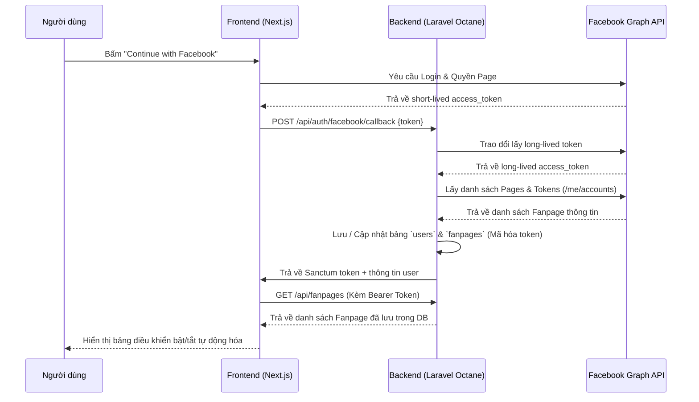

# 💻 Runbook: Frontend Setup & Integration — Phase 1

> **Ngày thực hiện:** 2026-06-17  
> **Người thực hiện:** Agent (Antigravity)  
> **Mục đích:** Khởi tạo Next.js App, tích hợp UI/UX Premium (Dark Mode, Glassmorphism), tích hợp luồng Facebook SDK Login & kết nối API đồng bộ Fanpage với Laravel Backend.

---

## 1. Khởi tạo Frontend Next.js

Chúng ta đã khởi tạo Next.js trực tiếp trên **host machine** để tránh việc lag/chậm do Docker file-watching trên Windows/WSL2.

**Lệnh thực hiện:**
```bash
npx -y create-next-app@latest ./ --ts --tailwind --eslint --app --import-alias "@/*" --use-npm --disable-git --yes
```

**Các thư viện bổ sung:**
- `lucide-react` (Bộ icon hiện đại)

**Kết quả:**  
Next.js v16+ cùng React v19+ được cài đặt thành công với cấu trúc thư mục App Router tối giản dưới `frontend/src`.

---

## 2. Thiết kế Giao diện Premium (UI/UX)

Để mang lại cảm giác cực kỳ cao cấp, hệ thống UI/UX được định hình với các yếu tố sau tại [globals.css](file:///r:/_Projects/Eurus_Workspace/Zeflyo/frontend/src/app/globals.css):
- **Bảng màu Tailored HSL:** Tông tối chủ đạo (`#09090b`), chữ sáng (`#f4f4f5`), màu nhấn xanh dương công nghệ (`#3b82f6`).
- **Ambient Glowing Circles:** Sử dụng hai khối hình cầu mờ ảo phát sáng chuyển động chậm (`animate-pulse-glow`) ở góc trên bên trái và dưới bên phải để tăng độ sâu trực quan cho giao diện.
- **Glassmorphic Panels (`.glass-panel` & `.glass-card`):** Nền bán trong suốt với lớp lọc mờ (`backdrop-filter: blur(12px)`) và viền cực mảnh màu trắng trong suốt, bo tròn góc `2xl`. Tạo chiều sâu khi cuộn hoặc hover.
- **Subtle Micro-animations:**
  - `animate-float`: Chuyển động nổi bồng bềnh cho thông báo lỗi/thành công.
  - `hover:translate-y-[-2px]`: Phản hồi nhẹ nhàng khi di chuột qua các thẻ Fanpage.
  - Custom SVG Facebook Icon thay thế cho Lucide-react (vì Lucide v4+ đã bỏ các logo thương hiệu).

---

## 3. Các chức năng của trang chính (`src/app/page.tsx`)

Trang [page.tsx](file:///r:/_Projects/Eurus_Workspace/Zeflyo/frontend/src/app/page.tsx) được thiết kế chứa đầy đủ trạng thái cần thiết:

### 3a. Trạng thái Đăng nhập (Authentication)
- Tích hợp **Facebook Login** chính thức qua Facebook SDK cho Web.
- **Mock Developer Mode (Demo Sandbox):** Cho phép lập trình viên chạy thử giao diện ngay lập tức mà không cần tạo trước Facebook App ID hoặc kết nối mạng. Mock mode giả lập đầy đủ luồng bật/tắt tự động hóa của các trang và lưu dữ liệu vào `localStorage`.

### 3b. Quản lý Cấu hình Kết nối (Connection Settings)
- Tích hợp một bảng cấu hình thu gọn (Server Connection Settings):
  - Cho phép điều chỉnh động địa chỉ Backend API (`http://localhost`).
  - Cho phép nhập Facebook App ID để khởi chạy SDK tương ứng.
  - Lưu cấu hình vào `localStorage` của trình duyệt.

### 3c. Đồng bộ Fanpage & Trạng thái Bật/Tắt Tự động hóa
- Hiển thị danh sách Fanpage thu được từ tài khoản người dùng dưới dạng Grid.
- Mỗi Fanpage có hình ảnh, tên, ID Facebook, chỉ báo trạng thái hoạt động ("AI Agent Live" / "Offline").
- Nút toggle chuyển đổi trạng thái:
  - Khi bật/tắt, gọi API `POST /api/fanpages/{id}/toggle` lên Laravel backend để lưu trạng thái.
  - Cập nhật thời gian thực vào bảng tin hoạt động (Activity Feed) bên góc phải.

### 3d. Bảng tin Hoạt động thời gian thực (Live Activity Feed)
- Trình diễn nhật ký sự kiện mô phỏng hệ thống Webhook và Queue, giúp lập trình viên và người dùng giám sát tức thời khi AI trả lời tin nhắn của khách hàng.

---

## 4. Tích hợp Route Backend & Controller mới

Để hỗ trợ màn hình bật/tắt tự động hóa này hoạt động thực tế với Database, chúng ta đã bổ sung các thành phần sau ở backend:

### 4a. Controller mới: [FanpageController.php](file:///r:/_Projects/Eurus_Workspace/Zeflyo/backend/app/Http/Controllers/FanpageController.php)
Chứa 2 phương thức:
1. `index(Request $request)`: Trả về danh sách Fanpage của user đang đăng nhập (sắp xếp theo tên).
2. `toggleActive(Request $request, Fanpage $fanpage)`: Đảo ngược giá trị `is_active` của fanpage và lưu vào DB (kèm kiểm tra quyền sở hữu).

### 4b. Khai báo Routes mới trong [routes/api.php](file:///r:/_Projects/Eurus_Workspace/Zeflyo/backend/routes/api.php)
```php
Route::middleware('auth:sanctum')->group(function () {
    Route::get('/user', function (Request $request) {
        return $request->user();
    });

    Route::get('/fanpages', [FanpageController::class, 'index']);
    Route::post('/fanpages/{fanpage}/toggle', [FanpageController::class, 'toggleActive']);
});
```

Sau khi cấu hình, chúng ta đã chạy `php artisan octane:reload` thành công để làm mới bộ nhớ đệm của RoadRunner worker.

---

## 5. Hướng dẫn chạy thử nghiệm & Phát triển tiếp theo

### 5a. Chạy Backend (Docker)
```bash
# Đảm bảo containers đang chạy
docker compose up -d

# Chạy migration lần đầu (nếu chưa chạy)
docker compose exec app php artisan migrate
```

### 5b. Chạy Frontend (Local Host)
```bash
cd r:\_Projects\Eurus_Workspace\Zeflyo\frontend

# Khởi động Dev server
npm run dev
```
Mở trình duyệt truy cập: `http://localhost:3000`

### 5c. Quy trình kiểm tra (Testing Flow)
1. **Dùng Mock Dev Mode:**
   - Bấm vào nút **"Mock Dev Mode (Demo Sandbox)"**.
   - Bạn sẽ được chuyển thẳng vào giao diện Dashboard với 3 Fanpage giả lập.
   - Click nút **"Active / Deactivated"** của từng trang để test giao diện toggle và xem log cập nhật trực tiếp ở bảng tin bên phải.
2. **Dùng Real Facebook App:**
   - Mở rộng phần "Server Connection Settings", điền Facebook App ID của ứng dụng Meta của bạn.
   - Bấm **"Save Configurations"** để hệ thống khởi chạy lại Facebook Web SDK.
   - Bấm **"Continue with Facebook"** để cấp quyền. Sau khi đăng nhập, frontend sẽ tự động gửi Token về API Backend của bạn tại port `80`.

---

## 6. Xử lý sự cố (Troubleshooting)

### 🔴 Lỗi `[browser] Failed to fetch fanpages` khi load lại trang
*   **Nguyên nhân:** Khi người dùng click chọn **"Mock Dev Mode"**, một token giả lập dạng `mock_token_xxxx` được sinh ra và lưu vào `localStorage`. Khi load lại trang, hàm `useEffect` đọc token này lên và gọi hàm `fetchFanpages()`. Do token bắt đầu bằng `mock_`, nếu gửi trực tiếp đến Backend thực tế (`http://localhost/api/fanpages`), hệ thống xác thực Laravel Sanctum sẽ trả về **`401 Unauthorized`**, dẫn đến lỗi in ra console trình duyệt.
*   **Giải pháp đã xử lý:** Cập nhật hàm `fetchFanpages()` ở frontend để nhận diện token dạng `mock_`. Nếu là mock token, ứng dụng sẽ đọc danh sách Fanpage giả lập từ `localStorage` (`zeflyo_mock_pages`) thay vì gửi request HTTP lên API thực tế. Đồng thời in chi tiết mã lỗi của server trong log (`response.status`).

---

## 7. Sơ đồ luồng hoạt động Phase 1


